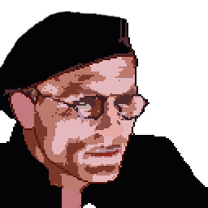

<h1 align="center">
  
  <br>
  Christof
  <br>
</h1>

Pequeño proyecto casero de vigilancia  usando una webcam.

[:es:](./README_ES.md) · [:gb:](./README.md)

## Instalación

- Vía Poetry:

  ```bash
  poetry install
  ```
  *Nota: Para más información sobre el gestor de dependencias Poetry visita [su documentación](https://python-poetry.org/docs/). La instalación de la librería puede hacerse con el siguiente comando:*

  ```bash
  curl -sSL https://raw.githubusercontent.com/python-poetry/poetry/master/get-poetry.py | python -
  ```

- Via '*requirements*':

  ```bash
  pip install -r requirements.txt
  ```

## Arrancar el servidor

Desde la raíz del proyecto

```bash
uvicorn app.main:app --reload 
```

## Líneas futuras

- [ ] Acceso a la GPU para incluir detecciones con modelos de DeepLearning.
- [ ] Compatibilidad con Jetson Nano.
- [ ] Control de la aplicación utilizando un bot de Telegram.
- [ ] ¿Panel de administración?